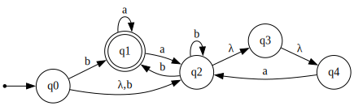
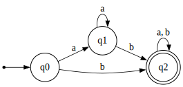

# far - finite automata runner
TP 1 de la materia Autómatas y Lenguajes.

El programa permite evaluar si una cadena es aceptada por un autómata o no.

## Descripción
El autómata se ingresa en formato .dot, el mismo puede ser deterministico o no.
Por defecto lo convierte a determinisico para hacer las evaluaciones más eficientes. Sin embargo, con la opcion `--no-convert` se puede forzar que la evaluación se haga sobre el no deterministico.

De manera automática el programa escribe el autómata deterministico generado en `output.dot`, aunque este comportamiento se puede modificar con los flags `-o <path>` y `--no-output-file`.


Se pueden ver las demás opciones con el flag `--help`.

## Ejemplo

Para ejecutar el programa con un archivo `.dot` y una cadena a evaluar, se puede hacer lo siguiente:

Se quiere verificar que "aaab" es aceptada por el siguiente autómata:


````dot
// non-det-aut.dot

digraph {
    rankdir = LR;
    node [shape = circle];
    edge [arrowsize = 0.8, penwidth = 0.8];
    inic [shape=point];

    // start state
    inic -> q0;

    // transitions
    q0 -> q1 [label="b"]
    q0 -> q2 [label="λ,b"]
    q1 -> q1 [label="a"]
    q1 -> q2 [label="a"]
    q2 -> q1 [label="b"]
    q2 -> q2 [label="b"]
    q2 -> q3 [label="λ"]
    q3 -> q4 [label="λ"]
    q4 -> q2 [label="a"]

    // final states
    q1 [shape=doublecircle];
}
````

> [!TIP]
> Se pueden declarar multiples símbolos separados por `,` o  `|`.

> [!NOTE]
> Para declarar transiciones lambda usar `λ`.

Utilizando `far`:

````
$ far non-det-aut.dot "aaab"
accepted
````

Y devuelve en `output.dot`


````dot
digraph {
    rankdir = LR;
    inic [shape = point];
    edge [arrowsize = 0.8, penwidth = 0.8];
    node [shape = circle];

    inic -> q0;
    q0 -> q2 [label = "b"];
    q0 -> q1 [label = "a"];
    q1 -> q2 [label = "b"];
    q1 -> q1 [label = "a"];
    q2 [shape = doublecircle];
    q2 -> q2 [label = "b"];
    q2 -> q2 [label = "a"];
}
````

## Build

### Dependencias:

- `g++` (C++17)
- `make`

### Compilación:
````
$ make
$ make clean
````
